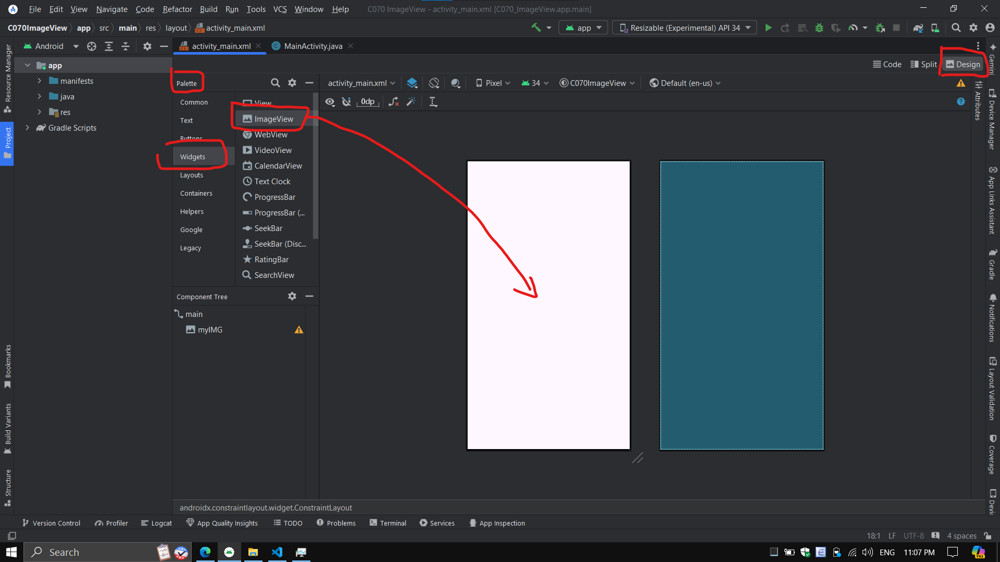
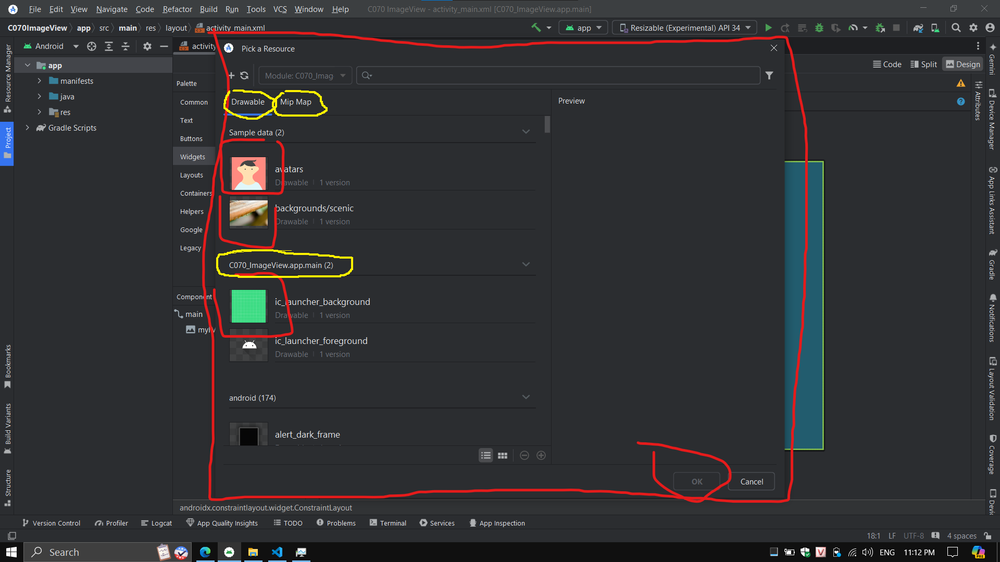
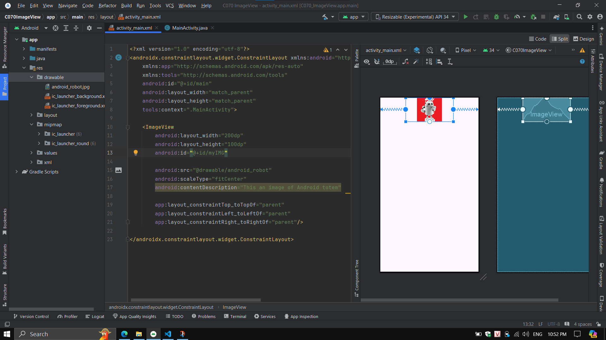
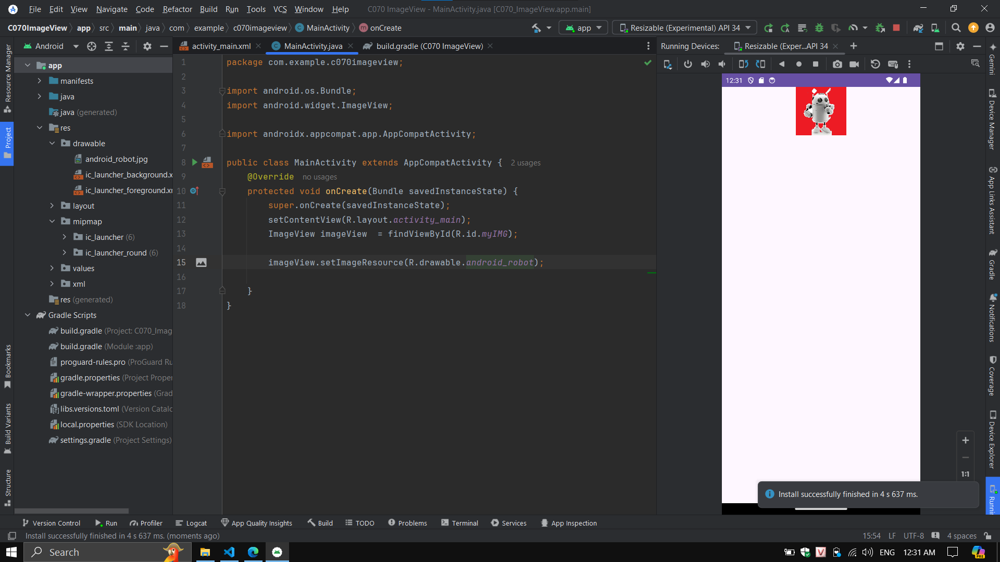

# __IMAGEVIEW__

- __ImageView__ là widget UI dùng để hiển thị hình ảnh trên Android app

## __THIẾT KẾ IMAGEVIEW__

- có 2 cách thiết kế widget ImageView là drag-drop và code XML

- để drag-drop ImageView, ta chọn làm theo các bước sau
    - chọn file XML
    - chọn mode Design
    - trong Pallete chọn Widgets
    - danh sách các item của Widgets chọn ImageView giữ chuột kéo thả vào màn hình thiết kế
    
    - sau khi drop ImageView vào màn hình app, Android Studio yêu cầu pick 1 sample picture có trong project ở folder drawable hoặc mipmap, ta có thể copy paste picture cần vào trong 1 trong 2 folder này (mipmap thường được dùng lưu trữ icon)
    

- để thiết kết ImageView bằng XML, trong file layout của Activity, ta dùng thẻ ``<ImageView />`` để đặt 1 widget ImageView lên trên layout của Activity
- sau tên tag ImageView là các attribute của ImageView, ngoài các attribute chung, ImageView cũng có những attribute riêng như
    - ``src`` : dùng chỉ định địa chỉ của Image cần hiển thị
    - ``scaleType`` : cách hiển thị Image bên trong biên của ImageView (biên được giới hạn bởi height và width)
    - ``contentDescription`` : văn bản mô tả nội dung của Image trong ImageView



## __LẬP TRÌNH VỚI IMAGEVIEW__

- để lập trình với ImageView, trong file Activity.java
    - khai báo instance của ImageView
    - khởi tạo instance với method ``findViewById(int)`` _tham số là ID của ImageView trong file layout_

- khi đã có instance của ImageView, ta có thể gọi những method mà ImageView hỗ trợ để sử dụng cho instance này
- ví dụ file XML ta chưa chỉ định ``src`` chỉ đến image cần hiển thị, trong file Java ta có thể gọi method ``setImageResource(int)`` để chỉ định image cần hiển thị

```xml
<?xml version="1.0" encoding="utf-8"?>
<androidx.constraintlayout.widget.ConstraintLayout xmlns:android="http://schemas.android.com/apk/res/android"
    xmlns:app="http://schemas.android.com/apk/res-auto"
    xmlns:tools="http://schemas.android.com/tools"
    android:id="@+id/main"
    android:layout_width="match_parent"
    android:layout_height="match_parent"
    tools:context=".MainActivity">

    <ImageView
        android:layout_width="200dp"
        android:layout_height="100dp"
        android:id="@+id/myIMG"

        android:scaleType="fitCenter"
        android:contentDescription="This an image of Android totem"

        app:layout_constraintTop_toTopOf="parent"
        app:layout_constraintLeft_toLeftOf="parent"
        app:layout_constraintRight_toRightOf="parent"/>

</androidx.constraintlayout.widget.ConstraintLayout>
```

```java
public class MainActivity extends AppCompatActivity {
    @Override
    protected void onCreate(Bundle savedInstanceState) {
        super.onCreate(savedInstanceState);
        setContentView(R.layout.activity_main);
        ImageView imageView  = (ImageView) findViewById(R.id.myIMG);

        imageView.setImageResource(R.drawable.android_robot);

    }
}
```
- result


